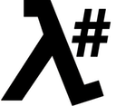

# LambdaSharp - Serverless .NET on AWS

**[Read what's new in the 0.6 "Favorinus" release.](https://lambdasharp.net/articles/ReleaseNotes-Favorinus.html)**

λ# is a command line tool and a framework for serverless application development. λ# uses a simple declarative syntax to generate sophisticated CloudFormation templates that provide simple, yet flexible, deployment options.

The objective of λ# is to accelerate the development pace of serverless solutions while helping developers adhere consistently to best practices to create scalable, observable, and modular systems.

## Give a Star! :star:

If you like or are using this project, please give it a star. Make sure to also check out the [documentation site](https://lambdasharp.net). Thanks!


## Install λ# CLI

The λ# CLI is installed as a .NET Global Tool.

```bash
dotnet tool install -g LambdaSharp.Tool
```

Once installed, the λ# CLI needs to be configured.
```bash
lash config
```

Finally, a deployment tier must be initialized with the λ# Core.
```bash
lash init --tier Sandbox
```

## Deploy a λ# Module

Creating modules with Lambda functions and deploying them only requires a few steps.

```bash
# Create a new λ# module
lash new module MySampleModule

# Add a function to the λ# module
lash new function MyFunction

# Deploy the λ# module
lash deploy
```

The λ# CLI uses a YAML file to compile the C# projects, upload assets, and deploy the CloudFormation stack in one step. The YAML file describes the entire module including the inputs, outputs, variables, resources, and functions.

```yaml
Module: MySampleModule
Items:

 - Function: MyFunction
   Memory: 128
   Timeout: 30
```

The C# project contains the Lambda handler.

```csharp
namespace MySampleModule.MyFunction {

    public class FunctionRequest {

        // add request fields
    }

    public class FunctionResponse {

        // add response fields
    }

    public class Function : ALambdaFunction<FunctionRequest, FunctionResponse> {

        //--- Methods ---
        public override Task InitializeAsync(LambdaConfig config)
            => Task.CompletedTask;

        public override async Task<FunctionResponse> ProcessMessageAsync(FunctionRequest request) {

            // add business logic

            return new FunctionResponse();
        }
    }
}
```

## Learn More

### Getting Started

1. [Setup λ#](https://lambdasharp.net/articles/Setup.html)

### Articles

1. [λ# — A Compiler for CloudFormation](https://medium.com/mindtouch-engineering/%CE%BB-a-compiler-for-cloudformation-b35744e49d6c)
1. [λ# — v0.5 Release Notes](https://medium.com/mindtouch-engineering/%CE%BB-news-0-5-rc1-released-906bdfc059a)
1. [λ# — v0.5.0.1 Release Notes](https://medium.com/mindtouch-engineering/%CE%BB-v0-5-0-1-release-notes-f07966ace1c5)
1. [λ# — v0.5.0.2 Release Notes](https://medium.com/mindtouch-engineering/%CE%BB-v0-5-0-2-release-notes-69458b35bddd)
1. [λ# — v0.5.0.3 Release Notes](https://medium.com/mindtouch-engineering/%CE%BB-v0-5-0-3-release-notes-9d27082609c5)
1. [λ# — Constructors/Destructors for CloudFormation](https://medium.com/mindtouch-engineering/constructors-destructors-for-cloudformation-stacks-233de1b1fcca)

### Samples

1. [Create a Static Website with CloudFormation](https://github.com/LambdaSharp/StaticWebsite-Sample)
1. [Create Animated GIFs from Videos with AWS Lambda](https://github.com/LambdaSharp/GifMaker-Sample)
1. [Create a Web Chat with API Gateway WebSockets](https://github.com/LambdaSharp/WebSocketsChat-Sample)
1. [Misc. λ# Samples](Samples/)

### References

1. [λ# CLI Reference](https://lambdasharp.net/cli/Index.html)
1. [λ# .NET SDK Reference](https://lambdasharp.net/sdk/Index.html)
1. [λ# Syntax Reference](https://lambdasharp.net/syntax/Index.html)
1. [λ# Module IAM Short-hands](src/LambdaSharp.Tool/Resources/IAM-Mappings.yml)
1. Modules
    1. [LambdaSharp.Core](https://lambdasharp.net/modules/LambdaSharp-Core.html)
    1. [LambdaSharp.S3.IO](https://lambdasharp.net/modules/LambdaSharp-S3-IO.html)
    1. [LambdaSharp.S3.Subscriber](https://lambdasharp.net/modules/LambdaSharp-S3-Subscriber.html)
    1. [LambdaSharp.Twitter.Query](https://lambdasharp.net/modules/LambdaSharp-Twitter-Query.html)
1. Resource Types
    1. [LambdaSharp::S3::EmptyBucket](https://lambdasharp.net/modules/LambdaSharp-S3-EmptyBucket.html)
    1. [LambdaSharp::S3::Subscription](https://lambdasharp.net/modules/LambdaSharp-S3-Subscription.html)
    1. [LambdaSharp::S3::Unzip](https://lambdasharp.net/modules/LambdaSharp-S3-Unzip.html)
    1. [LambdaSharp::S3::WriteJson](https://lambdasharp.net/modules/LambdaSharp-S3-WriteJson.html)

## License

> Copyright (c) 2018-2019 LambdaSharp (λ#)
>
> Licensed under the Apache License, Version 2.0 (the "License");
> you may not use this file except in compliance with the License.
> You may obtain a copy of the License at
>
> http://www.apache.org/licenses/LICENSE-2.0
>
> Unless required by applicable law or agreed to in writing, software
> distributed under the License is distributed on an "AS IS" BASIS,
> WITHOUT WARRANTIES OR CONDITIONS OF ANY KIND, either express or implied.
> See the License for the specific language governing permissions and
> limitations under the License.
