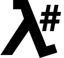

# LambdaSharp Scheduled Event Source

Before you begin, make sure to [setup your LambdaSharp CLI](https://lambdasharp.net/articles/Setup.html).

## Module Definition

An invocations schedule is created by adding a `Schedule` source to a function. The schedule can either be directly a [CloudWatch Events schedule expression](https://docs.aws.amazon.com/AmazonCloudWatch/latest/events/ScheduledEvents.html) or it can provide an expression and a name. The `Name` attribute is used to distinguish between multiple schedule events when needed.

```yaml
Module: Sample.ScheduledEvent
Description: A sample module using schedule events
Items:

  - Function: MyFunction
    Description: This function is invoked by a scheduled event
    Memory: 128
    Timeout: 30
    Sources:

      # a simple rate expression
      - Schedule: rate(1 minute)

      # a complex cron expression
      - Schedule: cron(0/15 11-17 ? * * *)

      # a schedule event with a name
      - Schedule: rate(1 hour)
        Name: Hourly
```

## Function Code

The schedule event can be parsed into a `LambdaScheduleEvent` message instance by using the `ALambdaFunction<T>` base class.

```csharp
public class Function : ALambdaScheduleFunction {

    //--- Methods ---
    public override Task InitializeAsync(LambdaConfig config)
        => Task.CompletedTask;

    public override async Task ProcessEventAsync(LambdaScheduleEvent schedule) {
        LogInfo($"Id = {schedule.Id}");
        LogInfo($"Time = {schedule.Time}");
        LogInfo($"Name = {schedule.Name}");
    }
}
```

## Reference

The LambdaSharp CLI creates a CloudWatch Events rule for each schedule expression. The `Name` value, when provided, is injected using an input transformer. This allows the receiving code to differentiate invocations across different events.

```csharp
public class LambdaScheduleEvent {

    //--- Properties ---
    public string Id { get; set; }
    public DateTime Time { get; set; }
    public string Name { get; set; }
}
```
